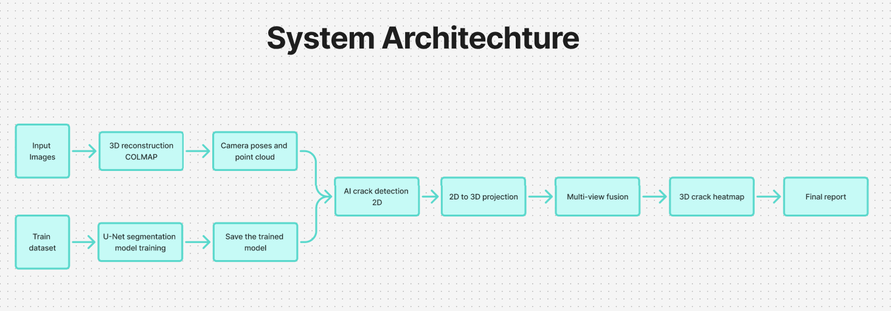
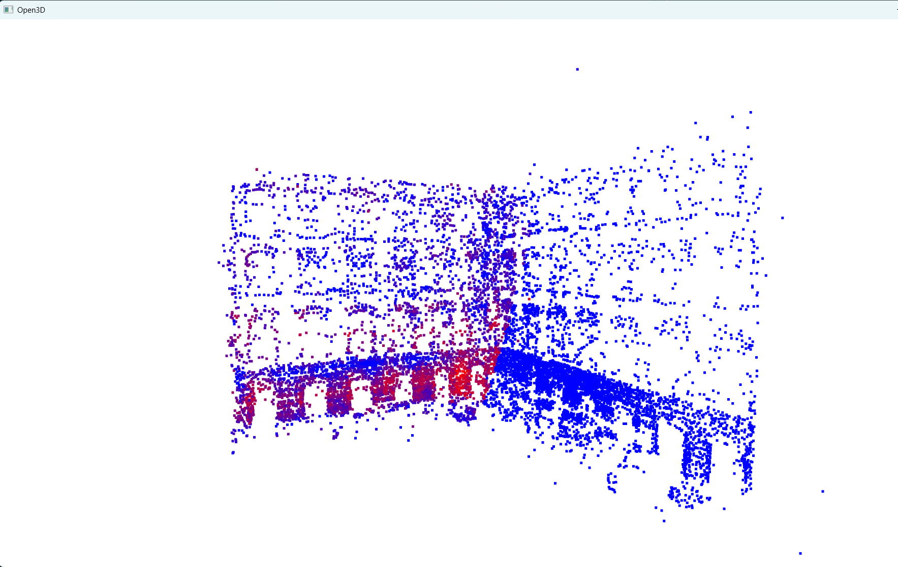

# 📌 Project Title
3D Crack Localization via AI and Multi-View Reconstruction

# 🧠 Motivation
Manual inspection of structures is subjective and difficult to quantify, while traditional 2D crack detection methods lack spatial context. This project proposes a 3D inspection pipeline that combines AI-based crack detection with geometric reconstruction to enable spatial localization and analysis of surface defects.

# 🎯 Objectives
- Detect surface cracks using deep learning
- Reconstruct inspected surfaces in 3D
- Localize cracks directly in 3D space
- Fuse evidence from multiple views
- Robustly fuse evidence from multiple views

# System Overview
### Architecture

### Point Cloud Results

3D point cloud with crack localization obtained by projecting 2D crack predictions into the reconstructed geometry.

### Multi-view Point Cloud Results

Multi-view 3D point cloud with crack localization obtained by projecting 2D crack predictions into the reconstructed geometry.

# Modules
- **Reconstruction:** COLMAP-based multi-view 3D reconstruction
- **Detection:** CNN-based crack segmentation on 2D images
- **Fusion:** Projection of 2D predictions into 3D space and multi-view aggregation 

# Methodology
1. Multi-view images are captured
2. COLMAP reconstructs geometry and camera poses
3. Crack detection is applied per image
4. Predictions are projected into 3D
5. Multi-view fusion builds a 3D crack heatmap

# Scope & Limitations
* Offline inspection (not real-time)
* Requires sufficient image overlap
* Detection accuracy depends on training data
