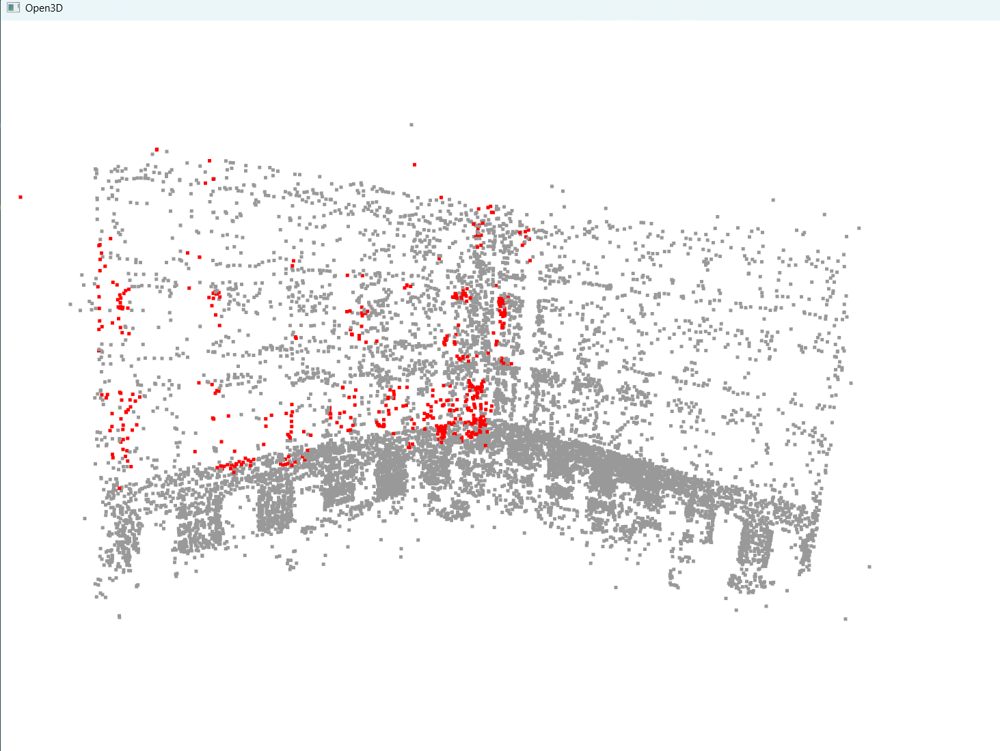

# 📌 Project Title
3D Crack Localization via AI and Multi-View Reconstruction

# 🧠 Motivation
- Manual inspection of structures is subjective and difficult to quantify.
- 2D crack detection lacks spatial context.
- This project proposes a 3D inspection pipeline combining AI and geometry.

# 🎯 Objectives
- Detect surface cracks using deep learning
- Reconstruct inspected surfaces in 3D
- Localize cracks directly in 3D space
- Fuse evidence from multiple views

# System Overview
### Architechture

### Point Cloud Results

### Multi-view Point Cloud Results

# Modules
- **Reconstruction:** COLMAP-based 3D reconstruction
- **Detection:** CNN-based crack segmentation
- **Fusion:** Projection and multi-view aggregation

# Methodology
1. Multi-view images are captured
2. COLMAP reconstructs geometry and camera poses
3. Crack detection is applied per image
4. Predictions are projected into 3D
5. Multi-view fusion builds a 3D crack heatmap

# Scope & Limitations
* Offline inspection (not real-time)
* Requires sufficient image overlap
* Detection accuracy depends on training data
